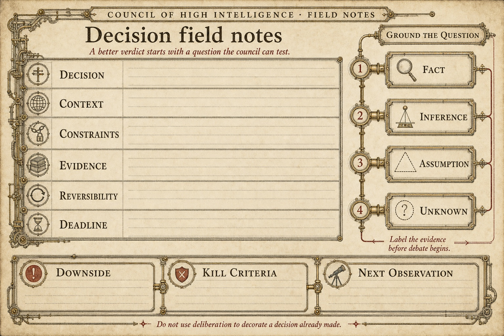
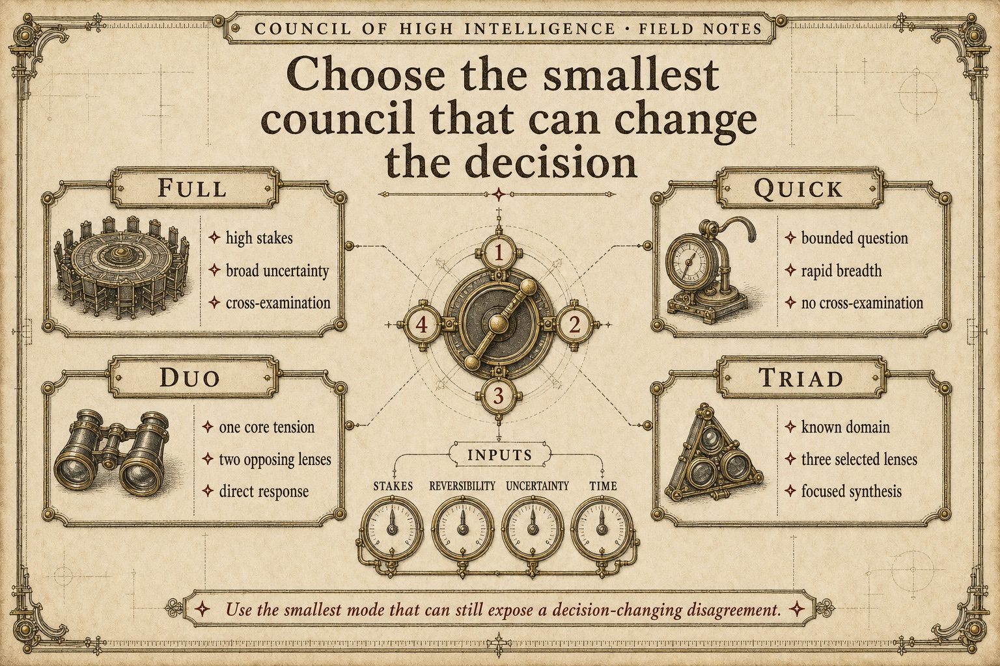
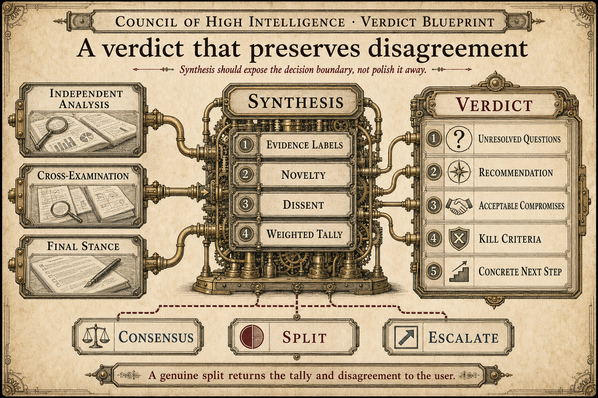
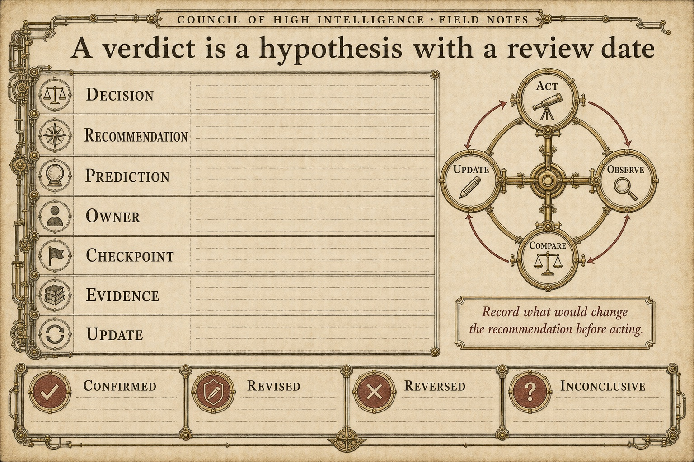
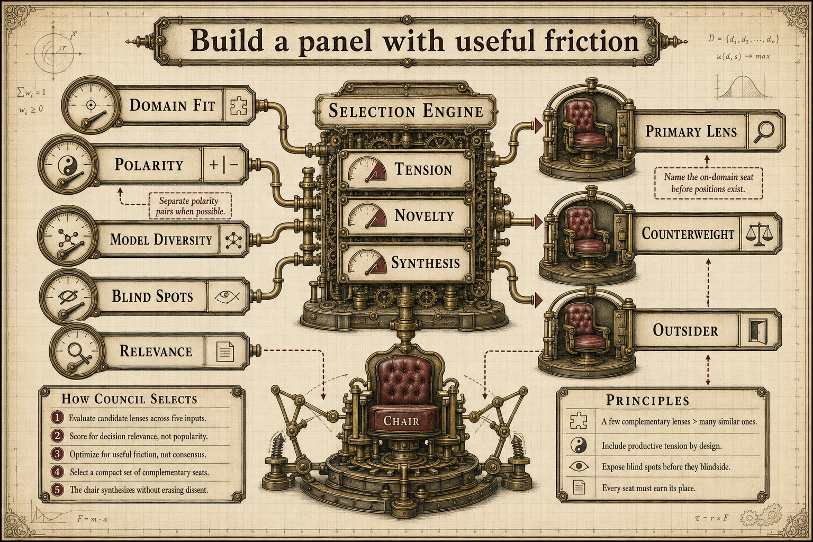
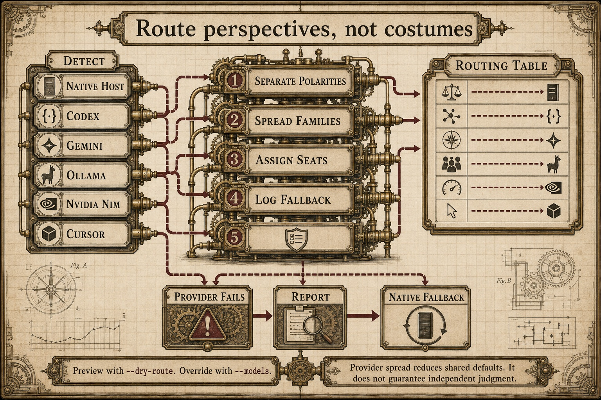
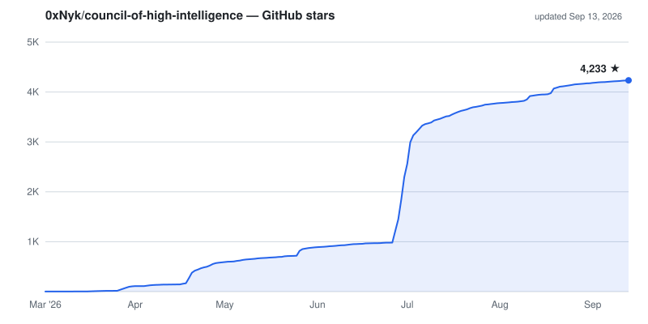

# Council of High Intelligence

<p align="center">
  
</p>

<p align="center">
  Structured multi-perspective deliberation for decisions that deserve more than one reasoning path.
</p>

<p align="center">
  <a href="https://github.com/0xNyk/council-of-high-intelligence/actions/workflows/lint.yml"></a>
  <a href="https://github.com/0xNyk/council-of-high-intelligence/releases"></a>
  <a href="LICENSE"></a>
</p>

<p align="center">
  Claude Code · Codex · Gemini CLI · OpenCode
</p>

The council assigns a hard question to deliberately different analytical personas, keeps
their first positions independent, forces direct disagreement, and returns a verdict that
preserves unresolved questions, dissent, kill criteria, and the next concrete action.

## Try a council

Claude Code users can install the plugin directly:

```text
/plugin marketplace add 0xNyk/council-of-high-intelligence
/plugin install council@council-of-high-intelligence
```

Then convene the full council, a faster panel, or a two-member dialectic:

```text
/council Should we open-source our agent framework?
/council --quick Should we add caching here?
/council --duo Should we use microservices or a monolith?
```

For Codex, Gemini CLI, or OpenCode, clone once and use the matching installer flag:

```bash
git clone https://github.com/0xNyk/council-of-high-intelligence.git
cd council-of-high-intelligence

./install.sh --codex-only
./install.sh --gemini-only
./install.sh --opencode-only
```

Restart the target client after installation. The command remains `/council` on every
supported host.

## Use it for the decision boundary

Good council questions have material downside, competing values, incomplete evidence, or
an irreversible choice. Write down the decision, constraints, evidence, reversibility, and
deadline before adding personas.



The field notes distinguish facts from inference, assumptions, and unknowns. They also make
it harder to use a long deliberation as decoration for a decision already made.

### When to use something smaller

- Use a direct answer or primary documentation for factual lookups.
- Run an experiment when the choice is cheap and reversible.
- Use `--quick` when cross-examination will not change the outcome.
- Use `--duo` when one tension matters more than broad coverage.
- Do not convene a council to manufacture support for a preferred answer.

## Choose a mode

| Mode | Shape | Use it when |
|---|---|---|
| Full | Independent analysis, cross-examination, final stance, synthesis | Stakes are high and competing frames need contact |
| Quick | Restate, rapid analysis, final positions | The decision needs breadth but not a full adversarial round |
| Duo | Opening positions, direct response, final statements | One polarity defines the decision |



```text
/council --full What is the right pricing model?
/council --quick --triad shipping Should we release today?
/council --duo --members torvalds,ada Is this abstraction worth it?
```

Named triads select three relevant lenses without assembling the whole council:

```text
/council --triad strategy Where is our defensible advantage?
/council --triad risk What could make this launch irreversible?
/council --triad ai-product Which capability belongs in the product?
```

Available domains include `architecture`, `strategy`, `ethics`, `debugging`, `risk`,
`shipping`, `product`, `founder`, `ai`, `ai-product`, `ai-safety`, `decision`, `systems`,
`uncertainty`, `design`, `economics`, and `bias`. The canonical routing table lives in
[`SKILL.md`](SKILL.md).

## What the protocol protects

The full protocol has a fixed round budget. Members first restate the problem, analyze
blind, cross-examine other positions, declare a final stance, and then enter synthesis.
Enforcement checks look for premature agreement, repeated claims, missing dissent, and
unsupported confidence.



Verdicts lead with what remains unresolved. A recommendation is paired with acceptable
compromises, kill criteria, and one concrete next step. When the weighted tally remains
split, the result returns that split to the user instead of turning it into prose consensus.

Evidence labels separate:

- `FACT`: directly supported by supplied or retrieved evidence;
- `INFERENCE`: follows from evidence but is not directly observed;
- `ASSUMPTION`: required for the argument and still unverified;
- `UNKNOWN`: missing information that could change the decision.

## Track the outcome

A verdict is useful only if it can be checked later. Before acting, record the prediction,
owner, review date, and evidence that would change the recommendation. At the checkpoint,
mark the result confirmed, revised, reversed, or inconclusive instead of rewriting the
original rationale.



## The 18 lenses

Members are analytical instruments, not impersonation claims. Each persona has a grounding
protocol, a method, known blind spots, and a structured response contract.



| Member | Primary lens | Useful counterweight |
|---|---|---|
| Aristotle | Categories and structure | Lao Tzu on emergence and excess structure |
| Socrates | Assumption destruction | Feynman on reconstruction from first principles |
| Sun Tzu | Terrain and adversarial strategy | Aurelius on internal control and moral cost |
| Ada Lovelace | Formal systems and abstraction | Machiavelli on incentives and informal power |
| Marcus Aurelius | Resilience and moral clarity | Sun Tzu on external competition |
| Machiavelli | Power and incentives | Ada on formal consistency |
| Lao Tzu | Non-action and emergence | Aristotle on explicit categories |
| Richard Feynman | Explanation and empirical debugging | Socrates on the premise itself |
| Linus Torvalds | Shipping and maintainability | Meadows on system-level consequences |
| Miyamoto Musashi | Timing and decisive action | Torvalds on acting before the ideal moment |
| Alan Watts | Reframing and false problems | Torvalds on concrete implementation |
| Andrej Karpathy | Empirical ML behavior | Sutskever on frontier risk |
| Ilya Sutskever | Scaling and AI safety | Karpathy on observation and iteration |
| Daniel Kahneman | Cognitive bias | Feynman on explicit causal reasoning |
| Donella Meadows | Feedback loops and high-impact interventions | Torvalds on local fixes |
| Charlie Munger | Inversion and model lattices | Aristotle on single-system classification |
| Nassim Taleb | Tail risk and fragility | Karpathy on smooth empirical trends |
| Dieter Rams | User clarity and restraint | Ada on what can be formalized |

The repository stores each member contract under [`agents/`](agents/). Custom panels can
use `--members`, named triads, or the `classic`, `exploration-orthogonal`, and
`execution-lean` profiles documented in [`SKILL.md`](SKILL.md).

## Multi-provider routing

The detection script checks which supported providers are available, then the coordinator
distributes seats across them. Polarity pairs are separated when possible so a single model
family does not play both sides of a disagreement.



| Provider path | Detection |
|---|---|
| Native host subagents | Available through the active supported client |
| OpenAI | `codex` executable |
| Google | `gemini` executable |
| Ollama | `ollama` executable |
| NVIDIA NIM | `NVIDIA_API_KEY` |
| Cursor | `cursor-agent` executable or configured login |

Preview routing without running a council:

```text
/council --dry-route --triad decision Should we accept this acquisition offer?
```

Use `--no-auto-route` to keep native-host defaults. Use `--models <path>` with a copy of
[`configs/provider-model-slots.example.yaml`](configs/provider-model-slots.example.yaml)
for an explicit seat map. Provider failure is reported before the seat falls back to the
native host.

## Installation reference

```bash
./install.sh                         # Claude Code
./install.sh --codex                 # Claude Code + Codex
./install.sh --codex-only            # Codex only
./install.sh --gemini                # Claude Code + Gemini CLI
./install.sh --gemini-only           # Gemini CLI only
./install.sh --opencode              # Claude Code + OpenCode
./install.sh --opencode-only         # OpenCode only
./install.sh --copy-configs          # Include provider-routing templates
./install.sh --dry-run               # Preview writes
```

Custom target directories are supported through `--claude-dir`, `--codex-dir`,
`--gemini-dir`, and `--opencode-dir`. Run `./install.sh --help` for the current contract.

## Verify the checkout

```bash
./scripts/council-simulation-checklist.sh
./install.sh --dry-run --codex
./install.sh --dry-run --gemini
./install.sh --dry-run --opencode
```

The checklist validates persona structure, host-protocol parity, routing configuration,
execution checkpoints, verdict fields, and installer behavior. Use the
[demo session pack](demos/session-pack.md) to exercise full, quick, and duo modes.
Restart your target client(s) after installing. Run `./scripts/council-simulation-checklist.sh` to validate. Try the [demo session pack](demos/session-pack.md) to test all modes.

### MCP Server Integration

The Council of High Intelligence can also be used as a standalone **Model Context Protocol (MCP)** server, exposing all 18 personas, domain triads, routing algorithms, and protocol rules to any MCP-compatible client.

The MCP server is packaged as a standard Python CLI tool. You can install it globally using `pip`, `pipx`, or `uv`:

```bash
# Install globally via pipx (recommended)
pipx install council-mcp

# Or install in your active environment
pip install council-mcp
```

#### Client Configuration

Because GUI applications (like Claude Desktop or Antigravity IDE) often do not inherit your terminal's `PATH` variables, it is highly recommended to use the **absolute path** to the `council` binary in your virtual environment (e.g., `/path/to/your/project/.venv/bin/council`), or use `uvx` for a zero-install approach.

> [!TIP]
> **How to find your absolute path:** After installing the package, simply run `which council` in your terminal. Copy the exact path it outputs and use that as your `command`.

##### Antigravity IDE
The recommended way to configure the server is directly through the IDE's user interface:
1. Open the **Antigravity IDE Settings** and navigate to **Customizations** on the left-hand side.
2. Click **Open MCP Config** and add the following configuration:
```json
{
  "mcpServers": {
    "council": {
      "command": "/absolute/path/to/your/.venv/bin/council",
      "args": ["mcp"]
    }
  }
}
```

##### Claude Desktop
Add the following to your `claude_desktop_config.json` (accessible via Claude Desktop's developer settings):
```json
{
  "mcpServers": {
    "council": {
      "command": "/absolute/path/to/your/.venv/bin/council",
      "args": ["mcp"]
    }
  }
}
```

##### Cursor
Go to **Cursor Settings > Features > MCP**, click **Add New**, and configure:
- **Type**: `command`
- **Name**: `council`
- **Command**: `/absolute/path/to/your/.venv/bin/council mcp`

#### Available Tools & Resources
The server exposes 18 tools and 5 resources, acting as a **knowledge and orchestration layer**. It does *not* execute LLM calls directly; instead, it generates the structured multi-round prompts, enforces the deliberation protocols, and renders the final verdicts, allowing the client AI to execute the actual reasoning.

**Key Tools:**
- `select_panel`: Select panel members for a problem (auto/manual/triad/profile/duo)
- `detect_providers`: Detect available LLM providers (Anthropic, OpenAI, Google, Ollama, NIM, Cursor)
- `compute_routing`: Compute member-to-provider routing table
- `generate_round_prompt`: Generate the exact prompts for any deliberation round
- `parse_stances_and_tally`: Parse STANCE lines and compute the weighted vote tally
- `render_verdict`: Render the final verdict document from structured data

**Resources:**
- `council://members`: All 18 members as structured JSON
- `council://protocol/{mode}`: Step-by-step protocol specifications

## Requirements

- [Claude Code](https://claude.ai/claude-code) CLI (required for Claude usage)
- [Codex](https://github.com/openai/codex) (required for Codex skill usage)
- Agent/subagent support in your client (enabled by default)

**Optional providers** (auto-detected for multi-provider routing):
- [Codex CLI](https://github.com/openai/codex) (OpenAI) — `npm i -g @openai/codex`
- [Gemini CLI](https://github.com/google-gemini/gemini-cli) (Google) — see [gemini-cli repo](https://github.com/google-gemini/gemini-cli)
- [Ollama](https://ollama.com) (local models) — install from ollama.com
- [Cursor CLI](https://cursor.com/cli) (GPT/Claude/Gemini/Grok aggregator) — `curl https://cursor.com/install -fsS | bash`

## Contributing

Contributions welcome. Read the [contribution guidelines](CONTRIBUTING.md) first.

## Support the Project

## Repository map

```text
SKILL.md                    canonical coordinator protocol
SKILL.codex.md              Codex host mirror
SKILL.gemini.md             Gemini CLI host mirror
SKILL.opencode.md           OpenCode host mirror
agents/                     18 grounded persona contracts
configs/                    provider and model-routing examples
demos/                      sample sessions and verdict template
scripts/                    detection, conversion, and validation tools
assets/                     brand system and README visuals
install.sh                  multi-host installer
```

Protocol changes start in `SKILL.md` and must remain behaviorally aligned with each host
mirror. See [CONTRIBUTING.md](CONTRIBUTING.md) for the required checks and review contract.
Security reports belong in [SECURITY.md](SECURITY.md), not a public issue.

## Project links

- [Release history](CHANGELOG.md)
- [Brand kit](assets/BRAND.md)
- [OSS profile](https://www.nyk.dev/oss/council-of-high-intelligence)
- [Sponsor ongoing maintenance](https://github.com/sponsors/0xNyk)
- [Maintainer: Nyk](https://nyk.dev) · [@nykdotdev](https://x.com/nykdotdev)
- [Issues](https://github.com/0xNyk/council-of-high-intelligence/issues)

<p align="center">
  <picture>
    <source media="(prefers-color-scheme: dark)" srcset="assets/star-history-dark.svg">
    
  </picture>
</p>

## License

[MIT](LICENSE) © 2026 [0xNyk](https://github.com/0xNyk)
